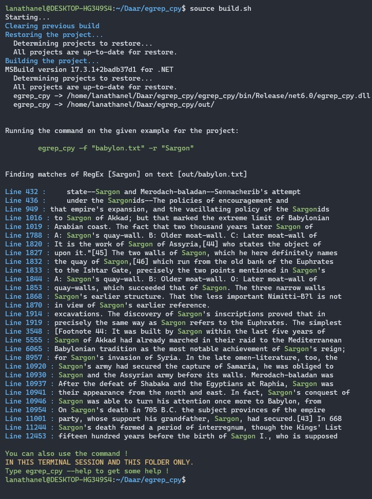

# 1. What is it
This is a copy of the egrep command provided by some linux distributions. Made as part of a project for Sorbonne University.

I do find the code quite self explicit as it is a simple implementation of the algorithms shown in the course, so I won't go into details about it.

# 2. How to run

### 1. Using the shell script (build.sh)

1. Install the dotnet SDK and runtime [here](https://dotnet.microsoft.com/en-us/download).
2. Go to the root folder (where the readme file is located).
3. Run the shell script using the source command (IMPORTANT).

    > source build.sh

    This will generate the binary under the out folder.

4. You should see the output for the regex "Sargon" on the text babylon. 
    You should now also be able to use the egrep command in your terminal. Obviously all previous flags still work here.

    > egrep -f "resources/babylon.txt" -r "Sargon" -cw

    You CANNOT use it outside of the folder where the build.sh script is located AND you CANNOT use it in another terminal window unless you run the script again.

5. Enjoy 😊! (hopefully 🤞)

Note that you can also run the binary file directly by going to the out folder and running ```./egrep_cpy -f <file> -r <regex> <other flags>```. 

### 2. Manually

1. Install the dotnet SDK and runtime [here](https://dotnet.microsoft.com/en-us/download).
2. Go to the root folder (where the readme file is located).
3. Restore the project :

    > dotnet restore

4. Run the project using this command :

    > dotnet run -c Releaase --project egrep_cpy -- -f "resources/babylon.txt" -r "Sargon" -cw

Note that you can choose your file and Regex and have some flags to customise the output, here is some help

```
egrep_cpy 1.0.0
Copyright (C) 2022 egrep_cpy

  -r, --regex     Required. The regular expression to use for matching.

  -f, --file      Required. The file to search in.

  -d, --detail    (Default: false) Shows a detailed output with the RegEx tree, the NFA and the DFA results or the carry over table depending on the algorithm used.

  -c, --count     (Default: false) Shows the total count of matches found.

  -w, --watch     (Default: false) Shows the time elapsed for parsing and matching the RegEx (excluding the printing to console time).

  -p, --pretty    (Default: false) Outputs the whole input file with the matches highlighted in green.

  --help          Display this help screen.

  --version       Display version information. 
```


5. Enjoy 😊! (hopefully 🤞)

# 3. Sample output

Here is a sample output for the regex "Sargon" on the text babylon.


